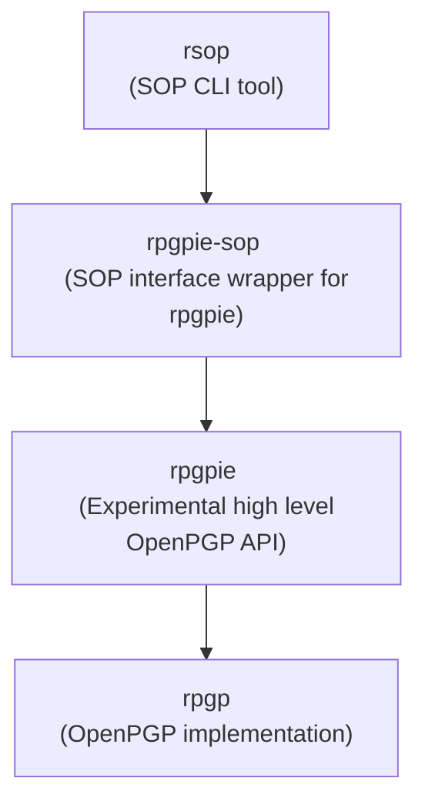

<!--
SPDX-FileCopyrightText: Heiko Schaefer <heiko@schaefer.name>
SPDX-License-Identifier: CC0-1.0
-->

# rsop and rpgpie-sop

- [rsop](rsop/) is a "Stateless OpenPGP" (SOP) CLI tool.
- [rpgpie-sop](rpgpie-sop/) is the basis of rsop; a SOP library wrapper for [rpgpie 🦀️🔐🥧](https://codeberg.org/heiko/rpgpie).

rsop and rpgpie-sop are based on:

- [rpgp](https://github.com/rpgp/rpgp/), a production-grade implementation of low-level OpenPGP functionality.
- [rpgpie 🦀️🔐🥧](https://codeberg.org/heiko/rpgpie), an experimental higher level OpenPGP API based on rpgp.
