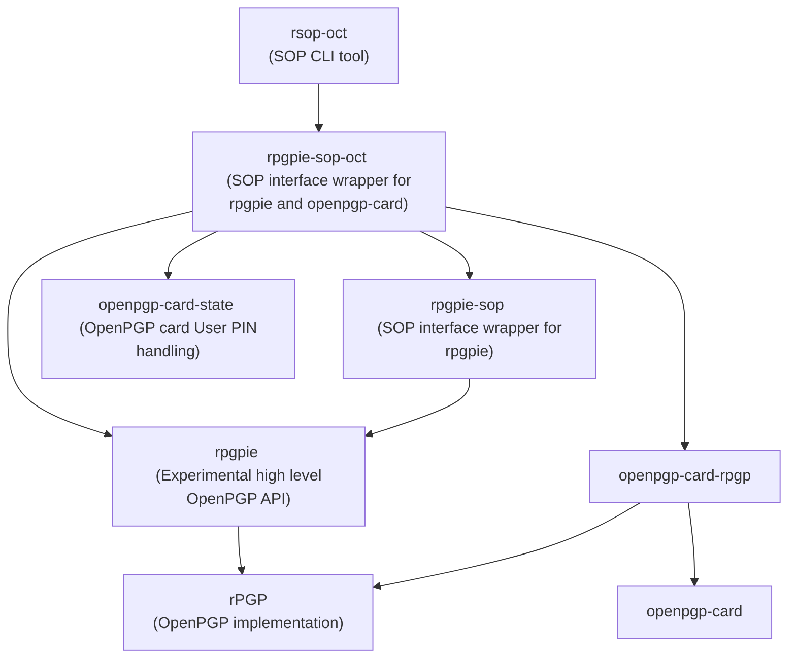

<!--
SPDX-FileCopyrightText: Heiko Schaefer <heiko@schaefer.name>
SPDX-License-Identifier: CC0-1.0
-->

# rsop-oct

`rsop-oct` is a special purpose "Stateless OpenPGP (SOP)" CLI tool.
SOP exposes a simple, standardized CLI interface to perform a set of common OpenPGP operations.

`rsop-oct` natively supports private key operations on OpenPGP card devices. It is based on a stack of [rPGP](https://github.com/rpgp/rpgp/), [openpgp-card-rpgp](https://crates.io/crates/openpgp-card-rpgp) and [rpgpie 🦀️🔐🥧](https://crates.io/crates/rpgpie).

## Stateless OpenPGP Command Line Interface

The stateless OpenPGP command line interface (SOP) is an implementation-agnostic standard for handling OpenPGP messages and key material.

Stateless OpenPGP tools - such as `rsop-oct` - are well suited for use in scripting use cases.

For more background and details about SOP, see <https://datatracker.ietf.org/doc/draft-dkg-openpgp-stateless-cli/>.

For the basic `rsop` tool see <https://crates.io/crates/rsop>. It supports private key operations based on software-based private key material (where key material is handled on the host computer, as opposed to in a hardware security device).

## Installing

`rsop-oct` can be built and installed from the Rust source code with cargo:

```
$ cargo install rsop-oct
[..]
```

Alternatively, you can check for rsop-oct in your system's packages.

## OpenPGP card support

`rsop-oct` natively supports use of secret key material on [OpenPGP card](https://en.wikipedia.org/wiki/OpenPGP_card) devices.

### User PIN

OpenPGP card devices require a *User PIN* to perform cryptographic operations. `rsop-oct` uses the [openpgp-card-state](https://crates.io/crates/openpgp-card-state) library for User PIN handling.

This means the User PIN must be available to `rsop-oct` via one of the backends supported by openpgp-card-state.

### Example test run

To demonstrate use of `rsop-oct` with an OpenPGP card, we'll perform a demonstration run here. For this demonstration we'll start with a spare card that we can overwrite.

In addition to `rsop-oct`, this example run uses the `oct` tool from the [openpgp-card-tools](https://crates.io/crates/openpgp-card-tools) crate to provision our OpenPGP card and `rsop` to generate a new OpenPGP private key.

#### Generating a test key

First, we generate a new private key for our test user, Alice. We use the file extension `.tsk` to signify that the file contains a [Transferable Secret Key](https://www.rfc-editor.org/rfc/rfc4880.html#section-11.2).

```
$ rsop generate-key "<alice@example.org>" > alice.tsk
```

Then, we extract a certificate representation from the TSK file. That is, we generate an equivalent "public key" for Alice, which omits the private key material. We store the certificate with the file extension `.cert`:

```
$ rsop extract-cert < alice.tsk > alice.cert
```

#### Setting up our OpenPGP card for testing

Now, we plug in our test OpenPGP card and check its identity:

```
$ oct list
Available OpenPGP cards:
FFFE:57011137
```

The card we're using in this example has the identity `FFFE:57011137` (this card contains no keys that we care about, so we are happy to use it. The following step entirely overwrites the card's contents!)

So first, we'll factory-reset the card, to start from a blank slate. This command removes any key material from the card, and resets the User and Admin PIN to their default values:

```
$ oct system factory-reset --card FFFE:57011137
Resetting Card FFFE:57011137
```

Now we import Alice's key material onto our test-card:

```
$ oct admin --card FFFE:57011137 import alice.tsk
Enter Admin PIN:
```

The default Admin PIN on most OpenPGP card devices is `12345678`. We entered this PIN at the prompt above.

We can have a look at the newly imported key material on the card, now:

```
$ oct status
OpenPGP card FFFE:57011137 (card version 2.0)

Signature key:
  Fingerprint: 26FD 6C05 D8AB 6D9A 7A27  A5CA DB2E 1E31 FB8E 9EA7
  Creation Time: 2024-04-08 16:26:54 UTC
  Algorithm: Ed25519 (EdDSA)
  Signatures made: 0

Decryption key:
  Fingerprint: 4B8D 7AE1 D4DE 65CE F0A8  4D2E A60A B338 5999 2476
  Creation Time: 2024-04-08 16:26:54 UTC
  Algorithm: Cv25519 (ECDH)

Authentication key:
  Fingerprint: [unset]
  Algorithm: RSA 2048 [e 32]

Remaining PIN attempts: User: 3, Admin: 3, Reset Code: 3
```

#### Configuring the User PIN for this card on our host

Now we need to store the User PIN for our test card in a mechanism that [openpgp-card-state](https://crates.io/crates/openpgp-card-state) can access. For this test, we'll just store the User PIN in a plain text config file. The easiest way to store the User PIN is to add the following content to the `openpgp-card-state` config file (you need to adjust the value for `ident` to reflect your own card's identity, if you're playing along at home):

```
[[cards]]
ident = "FFFE:57011137"

[cards.pin_storage]
Direct = "123456"
```

Note that after the `factory-reset` above, the User PIN of cards is typically `123456`. For this test run, we don't change the User PIN (this is obviously not good practice for production cards), and just store this User PIN value in the openpgp-card-state configuration file (using the "Direct" PIN storage backend, which means the PIN is stored directly in the config file, as plain text).

On Linux systems the openpgp-card-state config file is typically located in `~/.config/openpgp-card-state/config.toml`. It can be changed with any editor.

When using an OpenPGP card in production, with valuable key material on it, you might want to consider using a different PIN storage backend. See the documentation for [openpgp-card-state](https://crates.io/crates/openpgp-card-state) for more details about this.

#### Decryption on the card

We have now completed provisioning our card. In this example we will use the key material on the card to decrypt a message that was encrypted to Alice's certificate.

So first, we encrypt a message to Alice. To do this, we use Alice's public key material, from Alice's certificate `alice.cert`:

```
$ echo "hello alice" | rsop-oct encrypt alice.cert > alice.msg
```

Now, we can decrypt the message based on just the public key material for Alice. Notice that we're giving `rsop-oct` the certificate file `alice.cert`:

```
$ cat alice.msg | rsop-oct decrypt alice.cert
hello alice
```

Note that without using an OpenPGP card, this would not work! For software key-based operation, decryption needs the private key material from `alice.tsk`.

When using `rsop-oct` to perform private key operations on an OpenPGP card (that is: decryption or signing), a number of things happen in the background:

- All OpenPGP cards that are plugged into your system are enumerated.
- rsop-oct checks if any of the cards contains the private key material that matches the subkey in `alice.cert` that is relevant to the operation.
- Once a card with suitable key material is found, rsop-oct uses that card's identifier to look up the card's User PIN via the `openpgp-card-state` configuration (note that the PIN can be stored in different backends, which use different storage mechanisms and provide different security guarantees).
- If the user PIN is stored via `openpgp-card-state`, rsop-oct obtains it.
- The User PIN is presented to the card for verification. This authorizes the requested cryptographic operation.
- The cryptographic operation is performed on the card.

#### Signing on the card

Analogously, it's possible to produce a cryptographic signature with an OpenPGP card, using `rsop-oct`:

```
$ echo "hello world" | rsop-oct inline-sign alice.cert  > sig.alice
```

Note that, as above, the public key data in `alice.cert` is not by itself sufficient to issue a signature. As above for decryption, `rsop-oct` searches for an OpenPGP card device that contains the private signing key material which corresponds to the signing subkey in `alice.cert`, and asks the card to issue a signature with that key.

Once produced, anyone can verify this signature as usual, by checking its validity against Alice's public key material in the certificate `alice.cert`:

```
$ cat sig.alice | rsop-oct inline-verify alice.cert
hello world
```

## Rust SOP interface

The `rsop-oct` CLI tool is built using the excellent <https://crates.io/crates/sop> framework. The `rsop-oct` binary is trivially derived from [rpgpie-sop-oct](https://crates.io/crates/rpgpie-sop-oct).

## Overview of building blocks



## License

The (trivial) code of `rsop-oct` is CC0 licensed.

Note, however, that when building a binary package from it, the binary's license is (of course) dictated by the licenses of its dependencies.

# Warning, early-stage project!

`rsop-oct` and its foundational libraries (including rpgpie) are currently in an experimental, early development stage and are *NOT yet intended for production use*.
